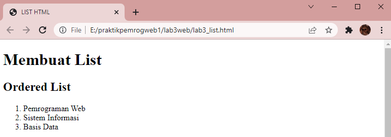

# Web3Lab3

**Nama    : Aning Kinanti** <br>
**NIM     : 312010364** <br>
**Kelas   : TI.20.A2** <br>
**Matkul  : Pemrograman Web** <br>

## Membuat List, Tabel dan Form

### 1. Membuat ordered list
Buatlah dokumen HTML seperti contoh dibawah ini : <br>
```
    <!DOCTYPE html>
    <html lang="en">
    <head>
        <meta charset="UTF-8">
        <meta http-equiv="X-UA-Compatible" content="IE=edge">
        <meta name="viewport" content="width=device-width, initial-scale=1.0">
        <title> LIST HTML </title>
    </head>
    <body>
        <header>
            <h1>Membuat List</h1>
        </header>
    </body>
    </html>
```
<br>

Lalu tambahkan sintaks pada tag <body> untuk membuat ordered list seperti berikut : <br>
```
    <section id="order-list">
        <h2>Ordered List</h2>
        <ol>
            <li>Pemrograman Web</li>
            <li>Sistem Informasi</li>
            <li>Basis Data</li>
        </ol>
    </section>
```
<br>

Ini adalah hasil dari sintaks diatas :
 <br>

