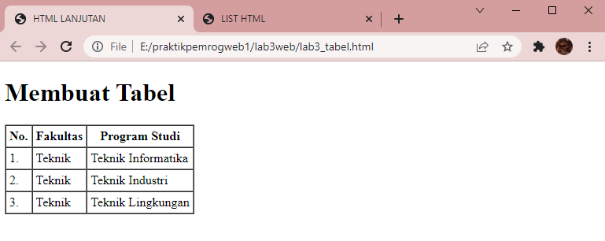
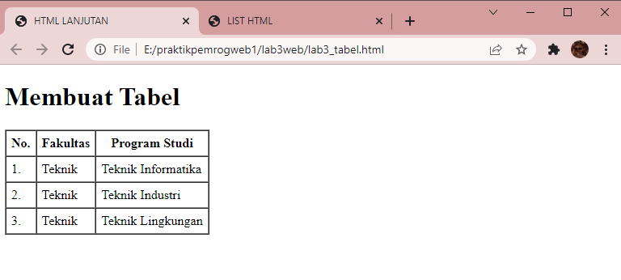
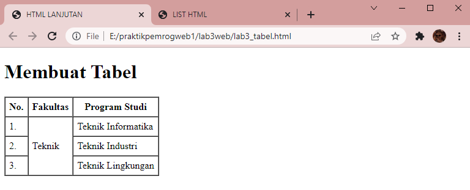

# Web3Lab3

**Nama    : Aning Kinanti** <br>
**NIM     : 312010364** <br>
**Kelas   : TI.20.A2** <br>
**Matkul  : Pemrograman Web** <br>

# Membuat List, Tabel dan Form

## A. Membuat List
### 1. Membuat Ordered List
Buatlah dokumen HTML seperti contoh dibawah ini : <br>
```
    <!DOCTYPE html>
    <html lang="en">
    <head>
        <meta charset="UTF-8">
        <meta http-equiv="X-UA-Compatible" content="IE=edge">
        <meta name="viewport" content="width=device-width, initial-scale=1.0">
        <title> LIST HTML </title>
    </head>
    <body>
        <header>
            <h1>Membuat List</h1>
        </header>
    </body>
    </html>
```
<br>

Lalu tambahkan sintaks dibawah ini pada tag <body> untuk membuat ordered list : <br>
```
    <section id="order-list">
        <h2>Ordered List</h2>
        <ol>
            <li>Pemrograman Web</li>
            <li>Sistem Informasi</li>
            <li>Basis Data</li>
        </ol>
    </section>
```
<br>

Ini adalah hasil dari sintaks diatas :
 <br>

### 2. Membuat  Unordered List
Tambahkan sintaks dibawah pada tag <body> untuk membuat unordered list : <br>
```
   <section id="unorder-list">
        <h2>Unordered List</h2>
        <ul type="square">
            <li>Jaringan Komputer</li>
            <li>Struktur Data</li>
            <li>Algoritma &amp; Pemrograman</li>
        </ul>
    </section>
```
<br>

Ini adalah hasil refresh dari sintaks diatas :
 <br>

### 3. Membuat Description List
Tambahkan sintaks dibawah pada tag <body> untuk membuat description list : <br>
```
   <section id="unorder-list">
        <h2>Description List</h2>
        <dl>
            <dt>Fakultas Teknik</dt>
            <dd>Teknik Industri</dd>
            <dd>Teknik Informatika</dd>
            <dd>Teknik Lingkungan</dd>
            <dt>Fakultas Ekonomi dan Bisnis</dt>
            <dd>Akuntansi</dd>
            <dd>Manajemen</dd>
            <dd>Bisnis Digital</dd>
        </dl>
    </section>
```
<br>

Ini adalah hasil refresh dari sintaks diatas :
 <br>

## B. Membuat Tabel
### 1. Membuat File HTML
Buatlah dokumen HTML seperti contoh dibawah ini : <br>
```
    <!DOCTYPE html>
    <html lang="en">
    <head>
        <meta charset="UTF-8">
        <meta http-equiv="X-UA-Compatible" content="IE=edge">
        <meta name="viewport" content="width=device-width, initial-scale=1.0">
        <title>HTML LANJUTAN</title>
    </head>
    <body>
        <header>
            <h1>Membuat Tabel</h1>
        </header>
    </body>
    </html>
```
<br>

Lalu tambahkan sintaks dibawah ini pada tag <body> untuk membuat tabel : <br>
```
   <table border="1" cellpadding="4" cellspacing="0">
        <thead>
            <tr>
                <th>No.</th>
                <th>Fakultas</th>
                <th>Program Studi</th>
            </tr>
        </thead>
        <tbody>
            <tr>
                <td>1.</td>
                <td>Teknik</td>
                <td>Teknik Informatika</td>
            </tr>
            <tr>
                <td>2.</td>
                <td>Teknik</td>
                <td>Teknik Industri</td>
            </tr>
            <tr>
                <td>3.</td>
                <td>Teknik</td>
                <td>Teknik Lingkungan</td>
            </tr>
        </tbody>
    </table>
```
<br>

Ini adalah hasil refresh dari sintaks diatas :
 <br>

### 2. Mengatur Margin dan Padding
Tambahkan atribut cellpadding dan cellspacing untuk mengatur margin dan padding pada cell data : <br>
```
   <table border="1" cellpadding="6" cellspacing="0">
```
<br>

Ini adalah hasil refresh dari sintaks diatas :
 <br>

### 3. Menggabungkan Sel Data
Gunakan atribut rowspan dan colspan untuk menggabungkan baris dan kolom : <br>
```
  <table border="1" cellpadding="6" cellspacing="0">
        <thead>
            <tr>
                <th>No.</th>
                <th>Fakultas</th>
                <th>Program Studi</th>
            </tr>
        </thead>
        <tbody>
            <tr>
                <td>1.</td>
                <td rowspan="3">Teknik</td>
                <td>Teknik Informatika</td>
            </tr>
            <tr>
                <td>2.</td>
                <td>Teknik Industri</td>
            </tr>
            <tr>
                <td>3.</td>
                <td>Teknik Lingkungan</td>
            </tr>
        </tbody>
    </table>
```
<br>

Ini adalah hasil refresh dari sintaks diatas :
 <br>


